# SpaceSyncX 

### 🚀 Welcome to the SpaceX App repository! 🌌

Embark on a cosmic journey with our captivating app designed for space enthusiasts like you! Stay updated on upcoming SpaceX rocket launches, explore intricate details about rockets and crew members, and immerse yourself in the boundless excitement of space exploration.

## Overview:

🚀 Built with Dart & Flutter Framework for seamless performance and stunning UI.

🎨 Crafted with meticulous attention to detail, ensuring an intuitive and visually appealing user experience.

✨ Leveraging packages like fancy shimmer effect, image, and provider for enhanced functionality.

🧼 Emphasizing clean, readable code for easy maintenance and scalability.

## How It Works:

🔧 Dive into the codebase and start contributing to the future of space exploration! Here's how you can get involved:

1. **Clone the Repository**: Begin your journey by cloning this repository to your local machine. Feel the thrill of anticipation as you embark on your cosmic coding adventure.

2. **Explore the Code**: Delve deep into the heart of the codebase, exploring each file and line with the curiosity of a true space explorer. Marvel at the intricacies of Dart and Flutter as you navigate through the galaxy of code.

## Project Design
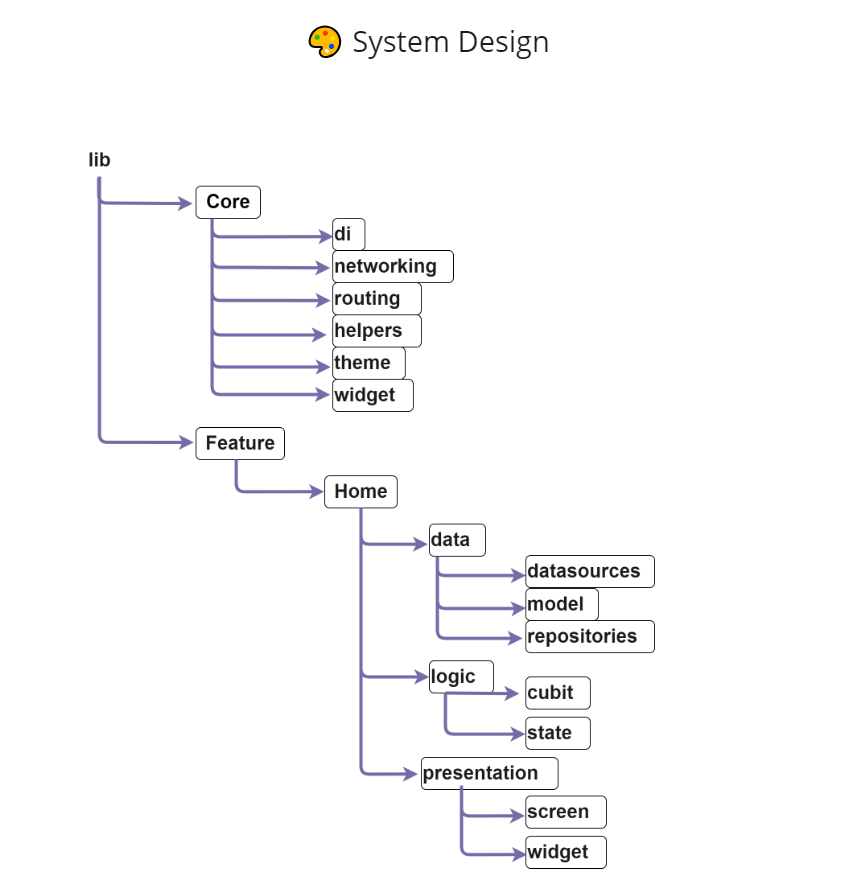

## Features:

1. 🚀 **Launches**:
   - Explore past and upcoming SpaceX launches.
   - Access detailed information about each launch.

2. 🛰️ **Rockets**:
   - Learn about SpaceX rockets, including specifications, cost, and launch history.

3. 🚀 **Ships**:
   - Know about active Ships, their description, company and more.

4. 👨‍🚀 **Crew**:
   - Dive into the backgrounds of astronauts who have participated in SpaceX missions.

5. ℹ️ **Company Info**:
   - Explore general information about SpaceX, such as its history, founder, valuation, and headquarters.

## Screenshot
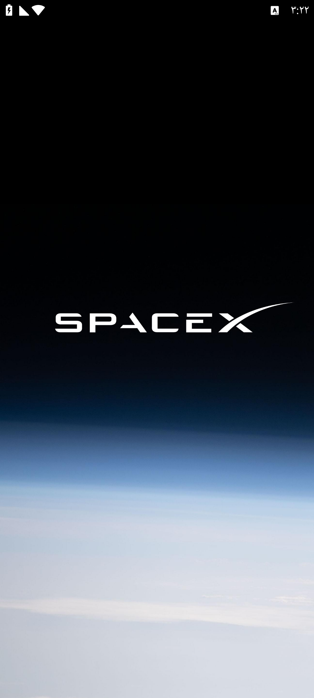
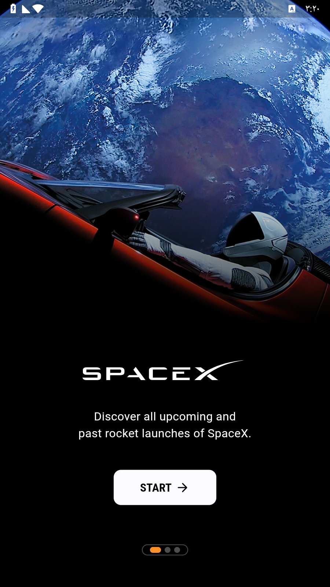
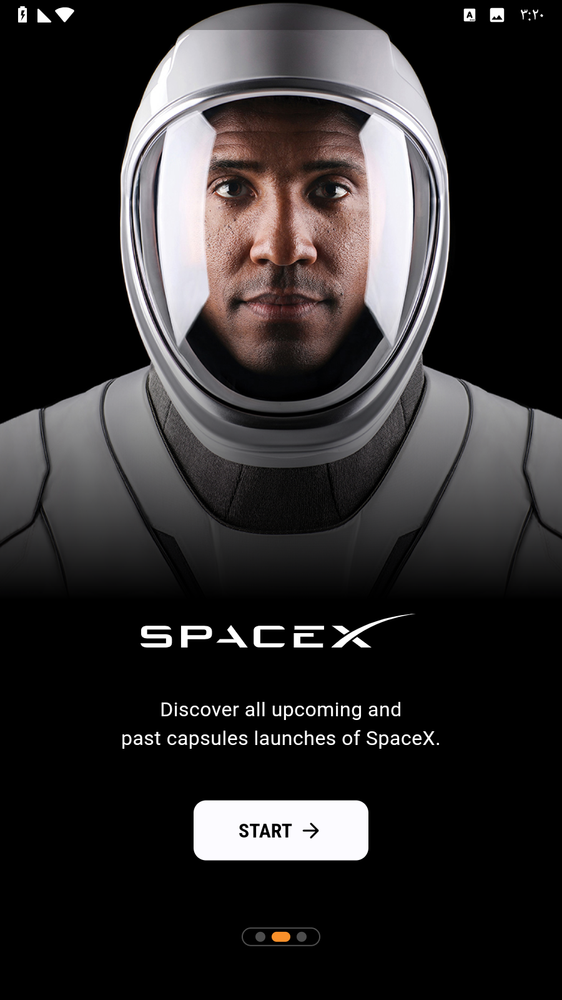
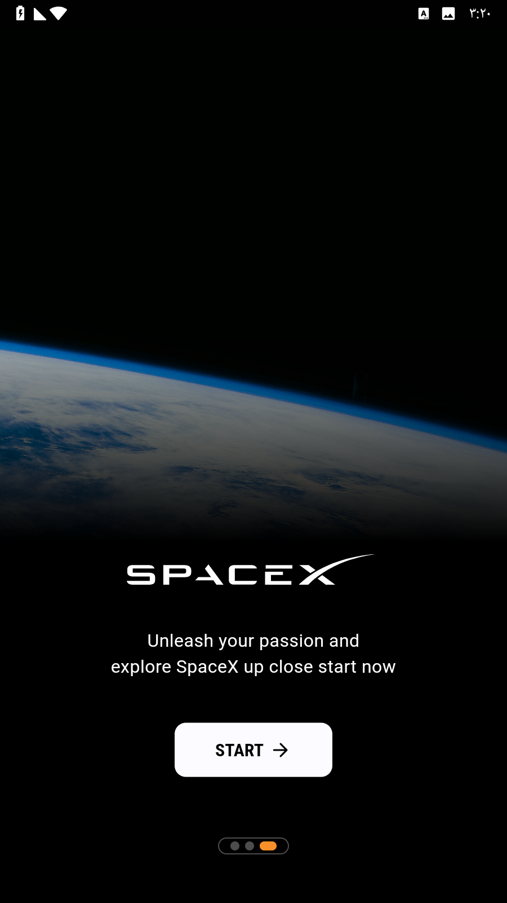
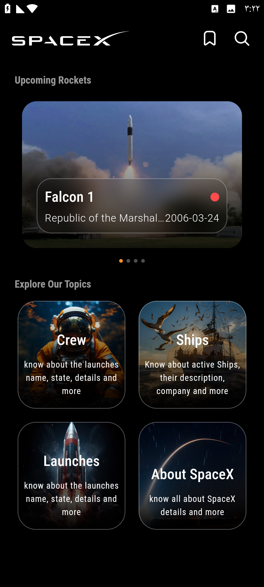
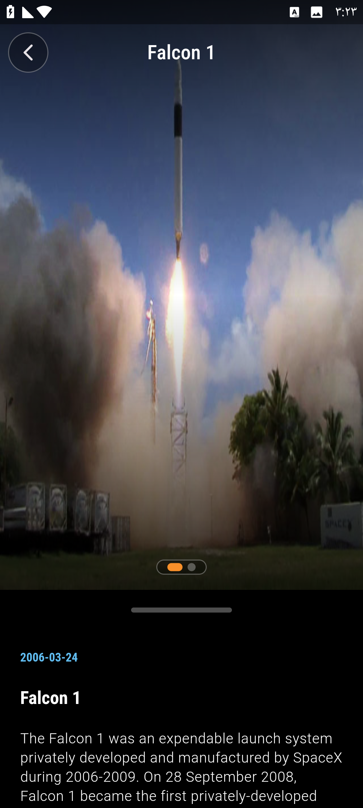
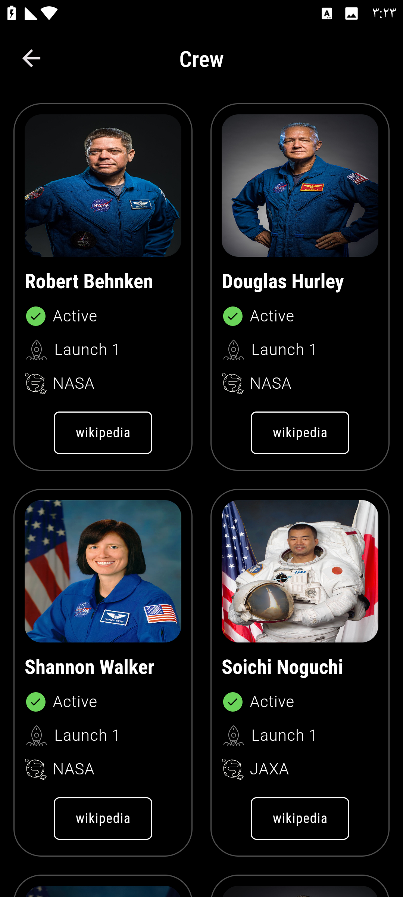
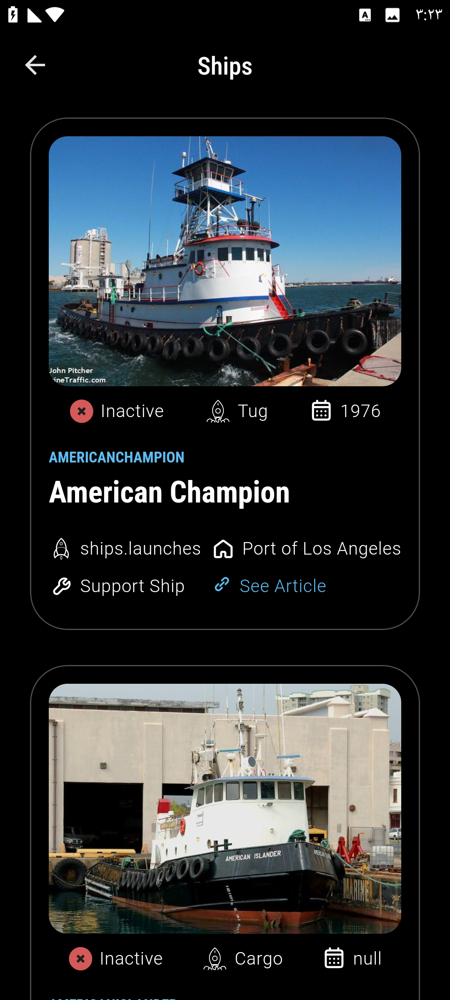
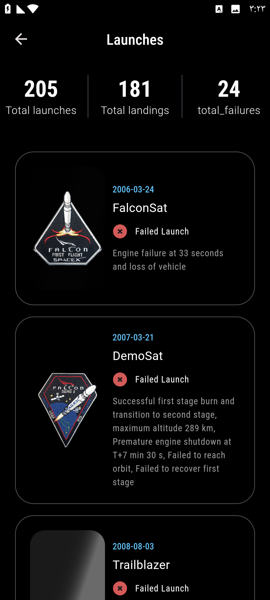
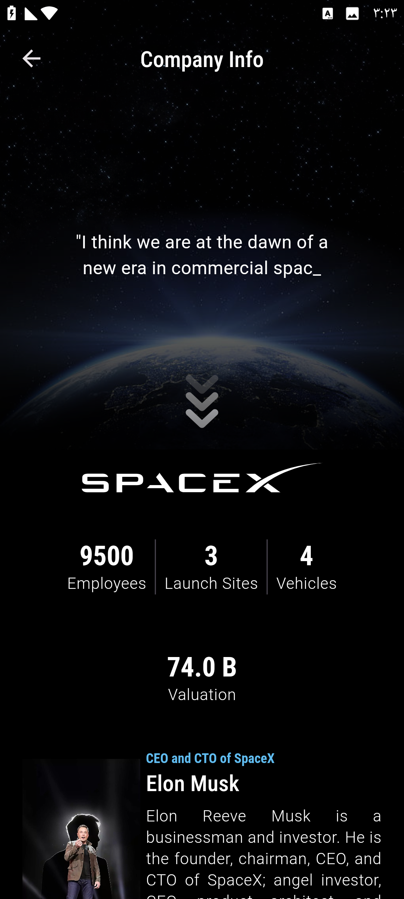

